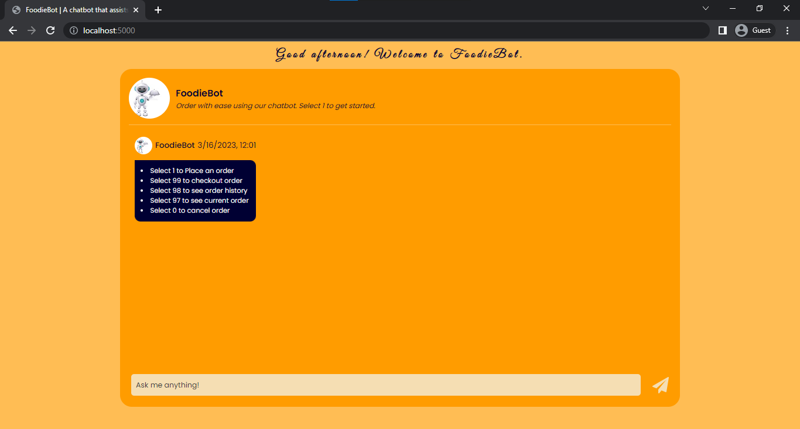

# FoodieBot 🍟🤖

## Description
FoodieBot is a chatbot application that assists customers in placing orders for their preferred meals.

## How to use
This chatbot application is pretty intuitive to use, but here are some instructions on how to use it:
- To see the menu, enter `1`.
- To place your order, enter the number preceding the items you want to order in comma-separated values, e.g `2,3,4`.
- To checkout an order, enter `99`.
- To see order history, enter `98`.
- To see current order, enter `97`.
- To cancel current order, enter `0`.

>**Note**- If you enter any command other than the ones above, the bot will regard it as an invalid response. Also, when ordering multiple items, enter the number preceding the items on the menu in comma-separated values, e.g. `2,3,4` (no spaces).

Built as a project at [Altschool Africa School of Engineering - Node.js track](https://www.altschoolafrica.com/schools/engineering)

## Tech Stack
### 1. Main Dependencies
 * **node.js** and **express** as the JavaScript runtime environment and server framework.
 * **mongodb** as a database of choice.
 * **mongoose** as an ODM library of choice.
 * **socket.io** as a WebSocket library of choice.
 * **express-session**- simple session middleware for Express.

## Main Files: Project Structure

  ```sh
  ├── README.md *** Instructions on how to set-up the project locally.
  ├── package.json *** The dependencies to be installed with "npm install"
  ├── server.js *** Entry point of the app
  ├── app.js
  ├── db.js
  ├── handlers.js
  ├── helpers.js
  ├── .env
  ├── example.env
  ├── models
  │   ├── userModel.js
  │   ├── chatModel.js
  │   ├── menuModel.js
  ├── middlewares
  │   ├── sessionMiddleware.js
  │   ├── socketMiddleware.js
  ├── views
  │   ├── index.pug
  ├── data
  │   ├── import-data.js *** File to be run independently to populate the "menus" collection with menu data or to offload the "menus" collection.
  │   ├── menu.json
  │   ├── options.json
  ├──  public
  │   ├── Chat.js
  │   ├── config.js
  │   ├── script.js
  └── └── style.css
```

## Getting Started Locally

### Prerequisites & Installation
To be able to get this application up and running, ensure to have [node](https://nodejs.org/en/download/) installed on your device.

### Development Setup
1. **Download the project locally by forking this repo and then clone or just clone directly via:**
```bash
git clone https://github.com/omobolajisonde/FoodieBot.git
```
2. **Create a .env file just like the example.env**
   - Assign the `SESSION_SECRET` variable a very strong secret.
   - Assign the `COOKIE_EXPIRES_IN` variable a very long time in milliseconds. 

3. **Set up the Database**
   - Create a MongoDB database on your local MongoDB server or in the cloud (Atlas).
   - Copy the connection string and assign it to the `DATABASE_URI` environment variable.
   - On connection to the database, four collections - `users`, `chats`, `menus` and `sessions` are created. Though the `sessions` collection is created by [connect-mongodb-session](https://www.npmjs.com/package/connect-mongodb-session), an external session store for the session.
   - In your terminal `cd` to the data directory and type the command `node import-data.js --import` to populate the `menus` collection with menu data. If you want to offload the `menus` collection, still in the data directory, type the command `node import-data.js --offload`.
  
## Models
---

### User
| Field  |  Data type | Description |
|---|---|---|
|  _id |  ObjectId |  auto-generated |
|  userId | String  |  required, unique, same as the userId in the stored in the session |
|  orders  |  Array |  A list of all the orders a user has checkedout  |
|  createdAt |  Date |  Defaults to current timestamp |

### Chat
| Field  |  Data type | Description |
|---|---|---|
|  _id |  ObjectId |  auto-generated |
|  message |  String | User or bot message |
|  isBotMsg | Boolean  | True or false depending on whether the message is from the user or the bot. |
|  userId  | ObjectId (ref: User) | Used to map every chat to a particular user or session |

### Menu
| Field  |  Data type | Description |
|---|---|---|
|  _id |  ObjectId |  auto-generated |
|  id |  Number | The number which is used when customers want to order a particular item on the menu. |
|  name |  String | Dish or Item name |
|  price | Number  | Dish or Item price |
|  course  | String | Dish or Item course |
|  cuisine  | String | Dish or Item cuisine |


4. **Install the dependencies** from the root directory, in terminal run:
```
npm install
```

5. **Run the development server:**
```bash
npm run dev
```
6. **At this point, your server should be up and running** at [http://127.0.0.1:5000/](http://127.0.0.1:5000/) or [http://localhost:8080](http://localhost:8080)

---

## Viewing the application in a browser
Visit http://127.0.0.1:5000/ or http://localhost:8080/ on your browser. You should see on you screen a page like the one below.


---

## Deployment
[foodiebotaltschool.onrender.com/](https://foodiebotaltschool.onrender.com/)

## Authors
[Sonde Omobolaji](https://github.com/omobolajisonde) 

## Acknowledgements 
The awesome team at Altschool.